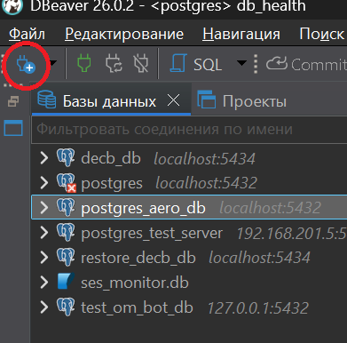
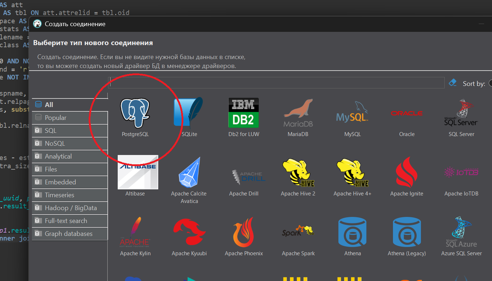
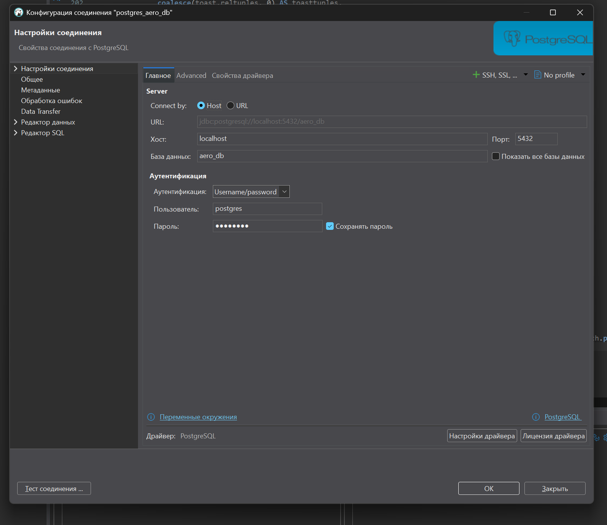

# База данных аэродинамических характеристик


Приложение для храненения и анализа результатов аэродинамических расчетов и экспериментов.


## HOWTO database

1. Ставим docker (если разбираешься можно podman):

windows
```powershell
winget install Docker.DockerDesktop
```

debian
```bash
sudo apt install docker.io
```

archlinux
```bash
sudo pacman -S docker
```

2. Ставим dbeaver (нужен для работы с БД):

windows
```powershell
winget install DBeaver.DBeaver.Community
```

debian
```bash
sudo apt install dbeaver-ce
```

archlinux
```bash
sudo pacman -S dbeaver
```

3. Поднимаем контейнер (надо находиться в одной папке с файлом docker-compose.yml):

```bash
docker compose up
```

или (старая версия)
```bash
docker-compose up
```

В случае установки Docker Desktop на Windows, можно использовать его графический интерфейс.

4. Подключаемся к БД с помощью dbeaver:

Жмем создать новое соединение:



Выбираем PostgreSQL (после того как нажмеш далее скачается драйвер):




Просто заполняем данные для подключения к БД:

имя базы данных: aero_db

пользователь: postgres

пароль: postgres



